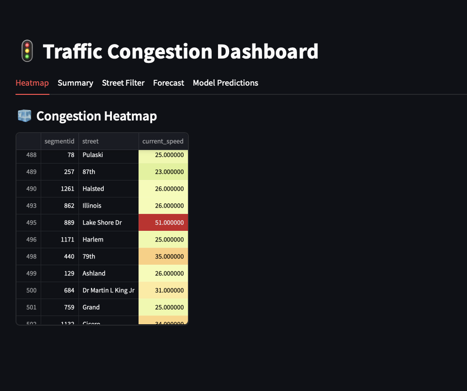
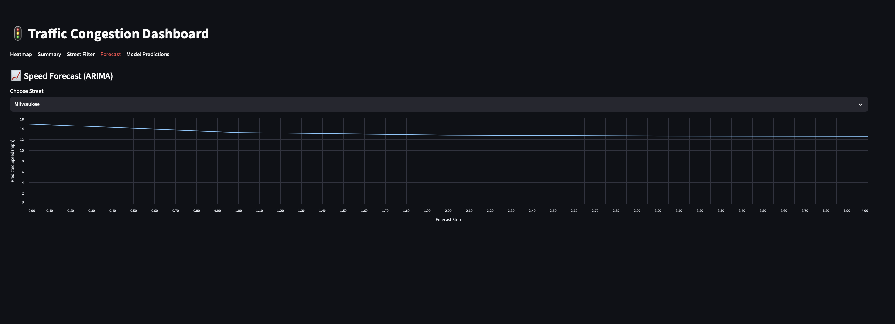
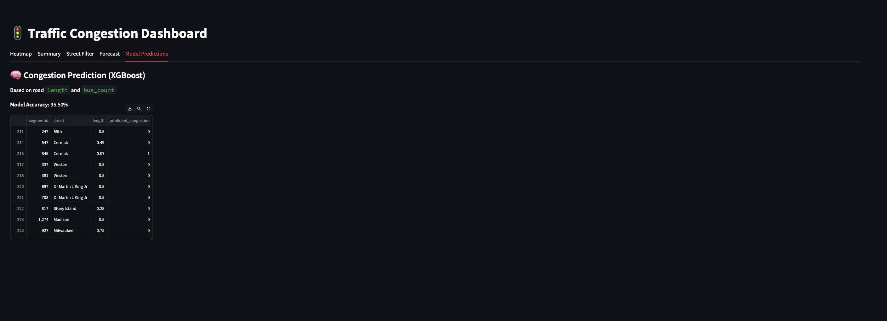

# 🚦 Smart Real-Time Traffic Insights

An end-to-end intelligent traffic analytics system built using **Kafka**, **PostgreSQL**, **XGBoost**, **ARIMA**, and **Streamlit**.  
It analyzes live Chicago traffic data to detect congestion, forecast speed trends, and display real-time insights through an interactive dashboard.

---

## 📸 Dashboard Preview

| Heatmap | Forecast | Model Prediction |
|--------|----------|------------------|
|  |  |  |

> _Add these screenshots inside an `images/` folder._

---

## 🚀 Features

- ✅ Real-time data ingestion from **Chicago Open Data API**
- ✅ Kafka-based producer/consumer pipeline
- ✅ PostgreSQL for storing batch and real-time data
- ✅ XGBoost-based congestion detection
- ✅ ARIMA-based speed prediction
- ✅ Beautiful Streamlit dashboard with live visualizations

---

## 🧠 Architecture

```
      [ Chicago Open Data API ]
                 |
         +-------v-------+
         |   Kafka       |  ← Real-time producer
         +-------+-------+
                 |
         +-------v-------+
         | PostgreSQL DB |  ← Consumer writes here
         +-------+-------+
                 |
         +-------v-------+
         |  Streamlit UI |  ← Visualization + ML
         +---------------+
```

---

## 📁 Folder Structure

```
SmartTrafficInsights/
│
├── data/
│   ├── historical_traffic.csv
│   ├── red_light_violations.csv
│   ├── speed_camera_violations.csv
│   └── traffic_crashes.csv
│
├── images/
│   ├── heatmap.png
│   ├── forecast.png
│   └── model.png
│
├── .env
├── .gitignore
├── requirements.txt
├── realtimetrafficanalysis.py
└── README.md
```

---

## ⚙️ Tech Stack

- **Backend**: Python, Kafka, PostgreSQL, SQLAlchemy
- **ML Models**: XGBoost (classification), ARIMA (forecasting)
- **Frontend**: Streamlit, Altair
- **Data**: Chicago’s open real-time traffic datasets

---

## 🧪 Setup Instructions

### 1. Clone the Repo

```bash
git clone https://github.com/Gautampande/smart-realtime-traffic-insights.git
cd smart-realtime-traffic-insights
```

### 2. Set Up Environment Variables

Create a `.env` file with:

```env
DATABASE_URL=your_postgresql_url
KAFKA_BROKER_URL=your_kafka_url
CA_CERT_PATH=path/to/ca.pem
SSL_CERT_PATH=path/to/service.cert
SSL_KEY_PATH=path/to/service.key
```

### 3. Install Dependencies

```bash
pip install -r requirements.txt
```

### 4. Run the App

```bash
python realtimetrafficanalysis.py
```

Open [http://localhost:8501](http://localhost:8501) to view the dashboard.

---

## 🔍 Machine Learning Models

### 🤖 XGBoost

- Classifies if a road segment is congested based on:
  - `length`
  - `bus_count`
- Outputs prediction with accuracy printed on the dashboard

### 📈 ARIMA

- Forecasts future traffic speeds for a given street
- Shows predicted values on a line chart

---

## 🖥️ Dashboard Features

- **Heatmap** – View real-time speed heatmap
- **Summary** – Bar chart of segment speeds + congestion status
- **Street Filter** – Filter data by street
- **Forecast** – Predict future speeds (ARIMA)
- **Model Predictions** – Show XGBoost outputs

---

## 📊 Sample Output

```bash
✅ realtime_traffic_data table ensured
✅ Batch data loaded
✅ Real-time data sent to Kafka
✅ 200 real-time records processed
✅ XGBoost model trained with accuracy: 95.00%
```

---

## 📃 License

MIT License

---

## 👨‍💻 Author

**Gautam Pande**  
🔗 [github.com/Gautampande](https://github.com/Gautampande)

---


